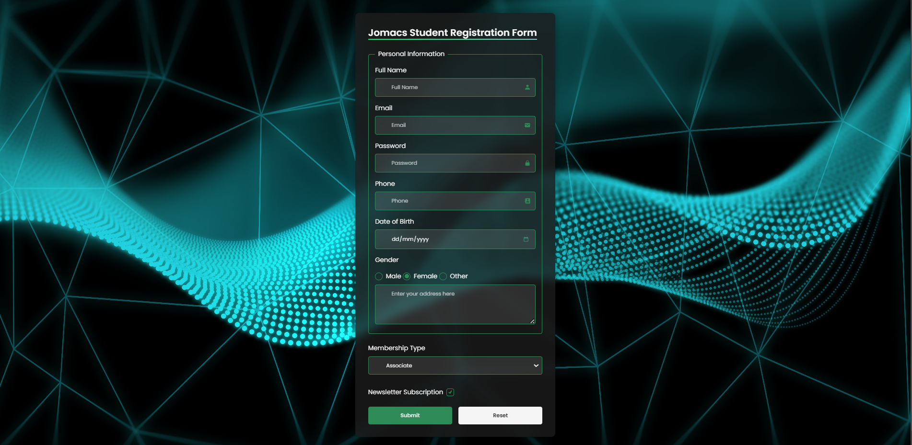

# Jomacs Registration Form Project

## Table of Contents

- [Overview](#overview)
- [The Challenge](#the-challenge)
- [Solution](#solution)
  - [HTML Implementation](#html-implementation)
  - [CSS Styling](#css-styling)
- [Result](#result)
- [Challenges Faced](#challenges-faced)
- [Links](#links)
- [Continuous Development](#continuous-development)

## Overview

This project implements a student registration form for Jomacs IT Solutions. The form features modern design elements, custom form controls, and responsive layout while maintaining semantic HTML structure and accessibility.

## The Challenge

Create a registration form with the following requirements:

- Collect essential user information (Full Name, Email, Password, etc.)
- Implement various input types (text, email, password, date, radio, checkbox)
- Use semantic HTML structure with fieldsets and legends
- Style the form with a modern UI including:
  - Custom form controls
  - Icon integration
  - Responsive design
  - Form validation
  - Reset functionality

## Solution

Form was designed with semantic HTML and vanilla CSS.

### HTML Implementation

#### Semantic Structure

Used semantic HTML5 elements for better accessibility and SEO:

```html
<main class="container">
  <section class="formContent">
    <form class="form" action="" method="post">
      <h1 class="formTitle">Student Registration Form</h1>
      <fieldset>
        <legend>Personal Information</legend>
        <!-- Form fields -->
      </fieldset>
    </form>
  </section>
</main>
```

#### Form Controls with Icons

Integrated Boxicons for form field indicators:

```html
<p class="formField">
  <label for="email">Email</label>
  <span class="inputWrapper">
    <input type="email" id="email" name="email" required>
    <i class="bx bxs-envelope"></i>
  </span>
</p>
```

### CSS Styling

#### Font Import and Reset

```css
/* Google Fonts */
@import url('https://fonts.googleapis.com/css2?family=Poppins:wght@300;400;500;600;700;800&display=swap');

/* Reset CSS */
* {
  margin: 0;
  padding: 0;
  box-sizing: border-box;
  font-family: 'Poppins', sans-serif;
}
```

#### Advanced Selectors

Used combinators and pseudo-classes for specific targeting:

```css
/* Chaining selectors */
.formField input[type="text"],
.formField input[type="email"] {
  width: 100%;
  padding: 0.75rem;
}

/* Adjacent sibling combinator */
.radioGroup label + label {
  margin-left: 1rem;
}

/* Pseudo-classes */
.inputWrapper input:focus {
  border-color: #3aa76d;
  box-shadow: 0 0 5px rgba(46, 139, 87, 0.5);
}
```

#### Custom Form Controls

Implemented custom radio buttons and checkboxes:

```css
.radioGroup input[type="radio"] {
  appearance: none;
  width: 1.2em;
  height: 1.2em;
  border: 2px solid #2e8b57;
  border-radius: 50%;
  display: grid;
  place-content: center;
}

.radioGroup input[type="radio"]::before {
  content: "";
  width: 0.65em;
  height: 0.65em;
  border-radius: 50%;
  transform: scale(0);
  transition: 120ms transform ease-in-out;
  background-color: #2e8b57;
}
```

## Result



## Challenges Faced

Some challenges are faced include:

1. Creating custom radio and checkbox controls while maintaining accessibility
2. Implementing gradient borders and transitions for button hover states
3. Styling the date input calendar icon consistently across browsers
4. Maintaining proper spacing and alignment in responsive design

## Links

- GitHub Repository: [View Code](https://github.com/JonesKwameOsei/registration-form-validator)
- Live Site: [View Demo](https://joneskwameosei.github.io/registration-form-validator/)

## Continuous Development

Future improvements planned:

- Add form validation using JavaScript
- Implement password strength indicator
- Add form submission functionality
- Create success/error message modals
- Enhance mobile responsiveness
- Add dark/light theme toggle
- Implement form data persistence

---

For a more detailed explanation of any section or to contribute to this project, please feel free to:

- Fork the this repo
- Clone your fork locally
- Create a new branch for changes
- Make your edits commit and push changes to your fork
- Open a pull request to the original repo
- Wait for feedback.

[⬆ Back to Top](#table-of-contents)
